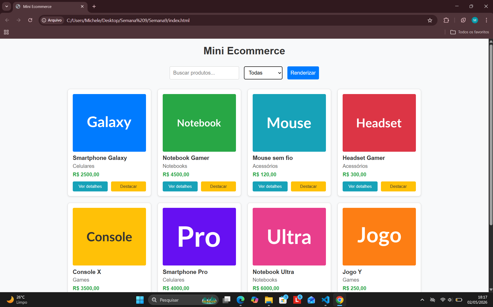
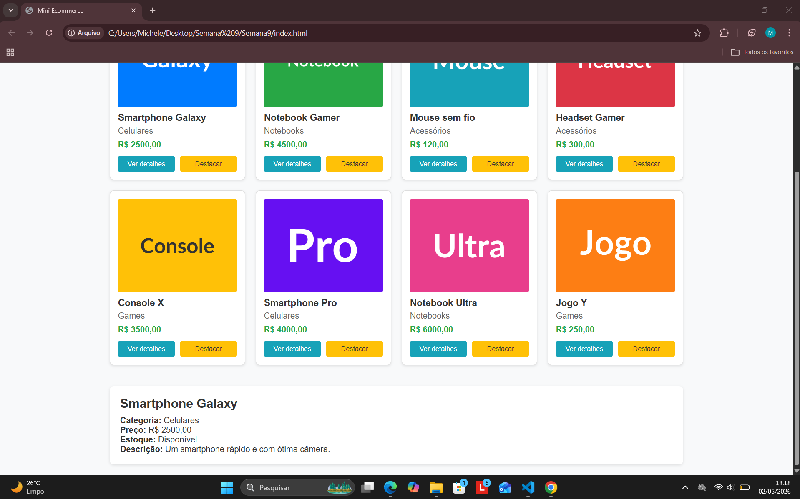
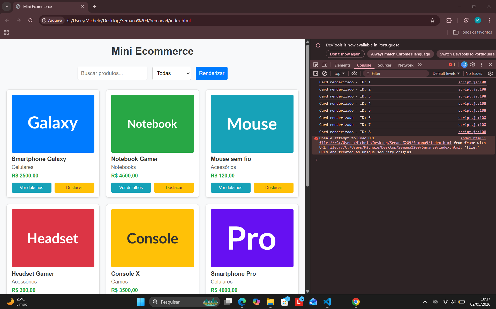

## Mini Ecommerce - Catálogo em Cards

Nesta atividade, você vai montar um programa para praticar funções em JavaScript e a manipulação do DOM, criando uma tela simples no estilo eCommerce que lista produtos em cards a partir de um objeto JSON (array de produtos).

Você vai usar métodos e propriedades do document e seus nodos para criar elementos, definir atributos, alterar conteúdo, estilizar e registrar eventos.

**Aluna:** Michele Fortunato Lima

**Matrícula:** 928047

**Proposta de Projeto:** Funções e Manipulação do DOM.

**Breve descrição sobre seu projeto:** Nesta atividade, desenvolvi um catálogo de Mini E-commerce para praticar a manipulação do DOM e o uso de funções em JavaScript. O projeto exibe produtos a partir de uma base de dados em JSON, permitindo ao usuário buscar itens por nome, filtrar por categoria, destacar cards e visualizar detalhes completos dos produtos.

## Capturas de Tela

### 1. Cards e Detalhes do Produto

### 2. Saída no Console

